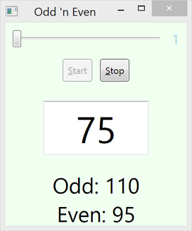

##Odd-Even Simulator
This app generates a series of random numbers. A running count of the number of odd and even numbers generated is presented. The generator commences when a button is clicked and similarly stopped.

The speed of the generation is governed by a Timer whose interval of firing is determined by the position of a slider control. Moving the slider to the left means numbers are generated more slowly. The 'speed' of generation is shown to the right of the slider while the number generated is shown writ large.

###Direction

- The slider _ValueChanged_ event must be captured to invoke a change to the _Interval_ property of the _Timer_.

- The current speed is displayed with a _Label_ control but binding should be used to update its value. You could however make this happen in the previous event handler but data binding is a better solution requiring little maintenance.

- There is no need to stop/start the _Timer_ to change its _Interval_